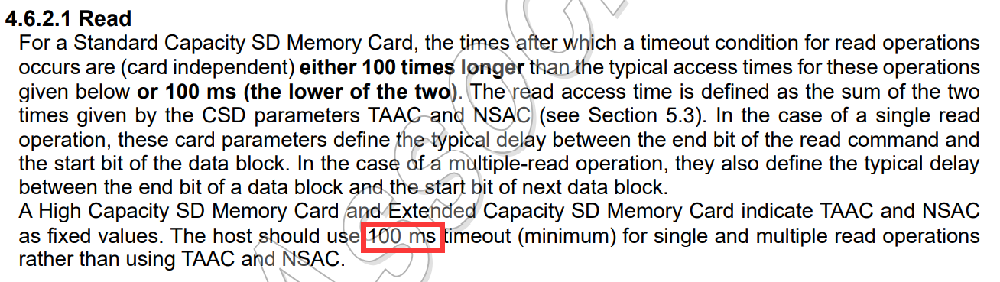
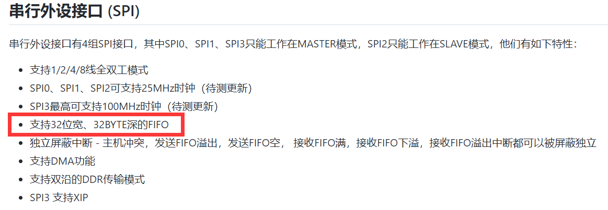

# SD卡驱动以及优化

起初编写SD卡驱动，我们主要有两个选择：

- 移植官方的SD卡驱动
- 移植xv6-k210自己编写SD卡驱动

由于前者经常被诟病「不稳定」，且在我们的实际尝试移植后也确有其事，因此我们选择移植的是xv6-k210项目自己编写的SD卡驱动。驱动本身也是通过底层官方SPI驱动来实现SD卡在SPI模式下的通信，但是在传输扇区数据时采用的是**DMA**传输。

## 发现问题

起初，因为我们自己内核中一些bug导致DMA无法正常传输，我们先将DMA传输更换回了原始传输模式，注意，这一尝试非常重要。在我们后续的不断测试中发现就算是xv6-k210自己编写的驱动在**去除掉DMA传输**后仍旧存在不稳定的情况，且这种不稳定的现象与官方的SD卡驱动的不稳定现象并无二致，换句话说，xv6-k210的SD卡驱动依旧存在着与官方SD卡驱动类似的**共性**问题没有被解决。

在不断调试过程中，我们逐渐发现了**中断**这一机制对SD卡数据传输的影响相当之大，xv6-k210的SD驱动在保护SD卡这一临界资源时使用的是xv6中的`sleeplock`（睡眠锁），此锁在获取后不同于`spinlock`（自旋锁），它不会保持中断关闭，也就是说，在获取`sdcard_lock`后，读取SD卡数据过程本身可能会被中断！在尝试在该过程中关闭中断后，不论是在官方的SD卡驱动下或是xv6-k210的驱动下，我们都得到了**相当稳定**的读取结果。

## 解决问题

但是事后反思，中断对于被中断的线程来说应该是透明的，不存在影响原有上下文的可能性，因此我们将原因定位在了通信协议的标准上，尤其是中断可能导致的**超时现象**。经过网上查证，以及参考相关的SD卡通信协议，发现确实是因为中断原因导致的超时。



在协议90页确实有关于SD卡超时读写的相关说明。对于高容量（>2GB）SD卡读取而言，它的超时时间为100ms。虽然中断处理时间也不至于那么久，但是试想这样一种情况：时钟中断到来，SD卡的读取被中断打断，转而跳转到中断处理函数处理时钟中断，而时钟中断导致了进程切换，后续再切换回读取SD卡进程，最后使得整个时间跨度大于100ms，造成了SD卡的读取失败！这才是导致SD卡驱动不稳定的**根本原因**。

可是为什么xv6-k210的驱动在实际使用中不会出现超时现象呢？原因就在于他们使用的是**DMA传输**而非普通的查询模式。在DMA模式下，不再是CPU自己读取SPI的传输数据而是交由第三方DMA负责搬运，这样自然不会再有上下文切换导致的超时现象了。

## 后续优化

仔细观察官方的SPI驱动实现逻辑，以及寄存器文档，可以发现相当大的优化空间。



k210的SPI具有32位宽的FIFO，而在实际的传输过程实现中，每个FIFO仅仅传输8位有效数据，也就是利用率仅为1/4，且每次传输后都还对传输来的数据进行二次拷贝处理！

```c
// 为什么需要二次拷贝？
// 以读取一块大小为512B的扇区为例，每次传输得来的数据宽度是32位，但是实际有效的仅仅为其中8位
// 所以每次传输而来的数据并非直接放置到用户给的缓冲区中，而是自己先准备一份缓冲区
char user_buf[512]; // 这是用户的缓冲区
char buf[512 * 4];  // 这是内部自建的缓冲区（源代码中是通过malloc）
// 将缓冲区buf作为目标地址交给DMA，DMA开始搬运...
// 搬运完成后需要进行拷贝转换
for(int i = 0; i < 512; i++) {
	user_buf[i] = ((uint32_t *)buf)[i];
}
// 完成
```

这将大大降低SPI的通信效率，就算使用**DMA传输**，其最后得到的收益甚至还赶不上拷贝的损耗。

经过我们的优化，在执行对根目录下所有文件（30个文件）读取一遍的速度提升为**1 tick**，请注意这里的**1 tick**绝非小数目，它代表的是**100ms**，因为我们还没有进行过大批量的测试，仅仅只有30个文件，并且在SD卡驱动之上还存在有块缓存，就算在这样的情况下，就已经出现如此明显的差距！


## 参考文献

[一个关于SD卡读写超时的话题 (stmicroelectronics.cn)](https://shequ.stmicroelectronics.cn/thread-628998-1-1.html)

[Simplified Specifications | SD Association (sdcard.org)](https://www.sdcard.org/downloads/pls/)

<div align="right">by yztz<br />2022/5/21</span>