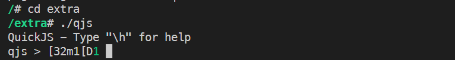
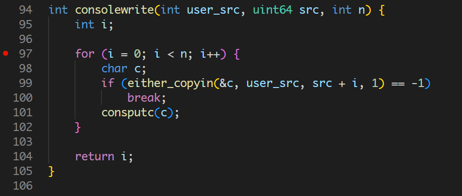
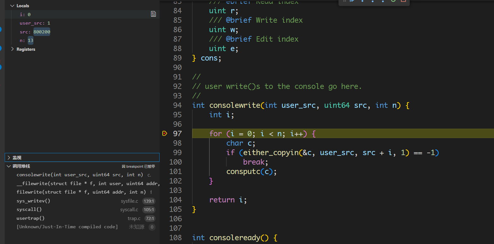
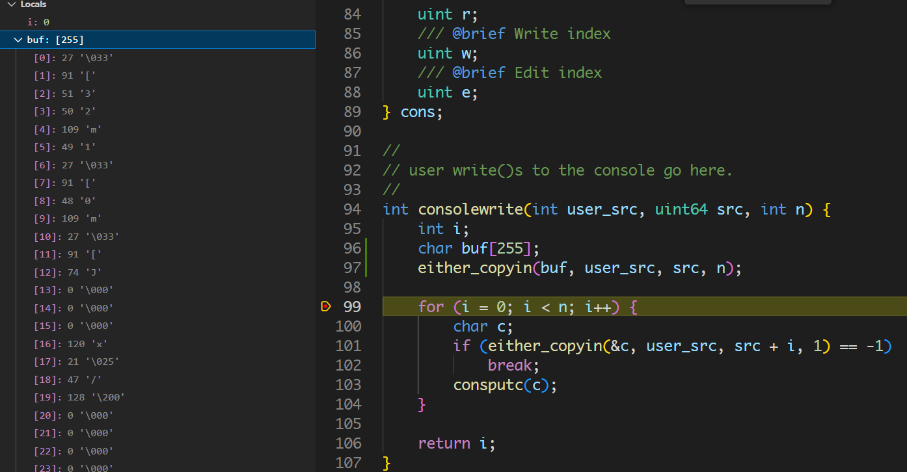
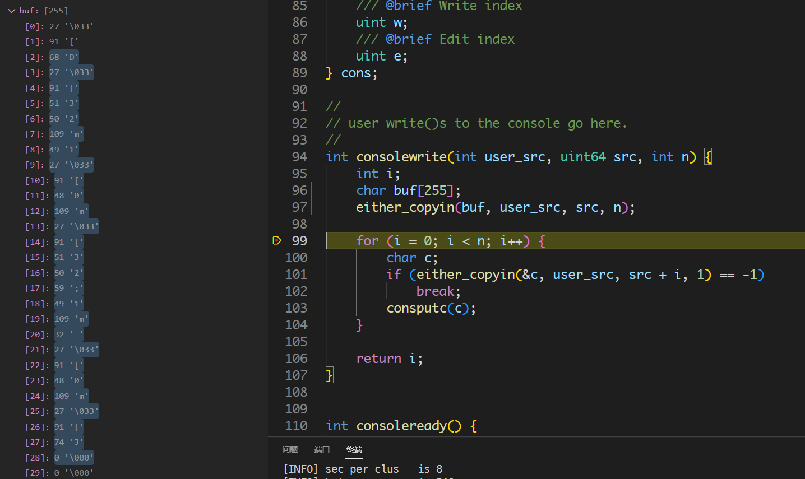
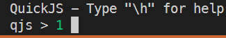
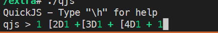
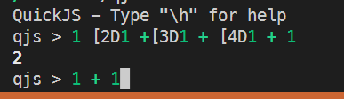
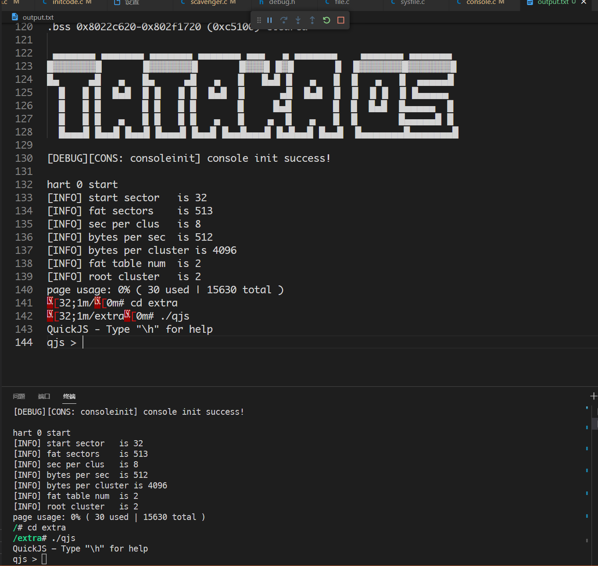
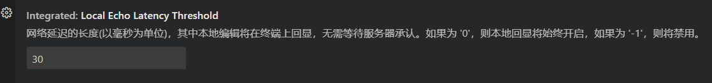

# vscode远程终端ANSI颜色渲染失败

## 起因

原本在调试OS的时候，想测试一下原先适配的QJS([QuickJS Javascript Engine](https://bellard.org/quickjs/))在多次系统版本迭代后会不会出现bug，以下是启动QJS的指令序列：

```shell
$ ./run-qemu.sh
...编译过程...
 ▄▄▄▄▄▄▄ ▄▄▄▄▄▄▄ ▄▄▄▄▄▄▄ ▄▄▄▄▄▄▄ ▄▄▄   ▄ ▄▄▄▄▄▄▄    ▄▄▄▄▄▄▄ ▄▄▄▄▄▄▄ 
█▓▓▓▓▓▓▓█       █▓▓▓▓▓▓▓█       █▓▓▓█ █▓█       █  █▓▓▓▓▓▓▓█▓▓▓▓▓▓▓█
█▄     ▄█   ▄   █▄     ▄█   ▄   █   █▄█ █   ▄   █  █   ▄   █  ▄▄▄▄▄█
  █   █ █  █▄█  █ █   █ █  █▄█  █      ▄█  █▄█  █  █  █ █  █ █▄▄▄▄▄ 
  █   █ █       █ █   █ █       █     █▄█       █  █  █▄█  █▄▄▄▄▄  █
  █   █ █   ▄   █ █   █ █   ▄   █    ▄  █   ▄   █  █       █▄▄▄▄▄█ █
  █▄▄▄█ █▄▄█ █▄▄█ █▄▄▄█ █▄▄█ █▄▄█▄▄▄█ █▄█▄▄█ █▄▄█  █▄▄▄▄▄▄▄█▄▄▄▄▄▄▄█

hart 0 start
[INFO] start sector   is 32
[INFO] fat sectors    is 513
[INFO] sec per clus   is 8
[INFO] bytes per sec  is 512
[INFO] bytes per cluster is 4096
[INFO] fat table num  is 2
[INFO] root cluster   is 2
page usage: 0% ( 30 used | 15630 total )
/# cd extra # qjs在extra目录下
/extra# ./qjs
QuickJS - Type "\h" for help
qjs > 
```

目前看来一切正常，我成功进入到了QJS的交互命令行中，但是当我刚想测试一下`1+1`时，问题出现了：

```shell
qjs > [32m1
```

我刚输入`1`时显示了以上字符，再次输入一个空格：



更加诡异了...不过细看输出字符，不难辨认是ANSI控制字符，不过转义输出似乎失败了。直到这里，我的第一反应是认为系统的console模块存在bug或者是底层uart驱动存在bug。对于uart，目前是直接移植的xv6，所以问题应该不会太大，况且在目前的场景下，其实并不存在并发的问题。于是，我把注意力放在了console模块上。

## 尝试解决

很明显，这里的问题是**输出**问题，所以主要使用GDB去追踪QJS输出的系统调用栈，回到刚刚QJS交互式命令行刚开始的地方，直接在console对外输出接口处打上断点:



输入`1`:



可以看到成功停在了断点处，观察左边的函数调用栈，可以知道QJS是通过writev来进行系统调用输出的，但是我们还是不知道当前要输出的字符串到底是什么，所以我们不妨在**已知字符串长度**（左上角可以看到`n = 13`）的情况下，先获取到所有字符，看看到底输出了哪些字符：



主要观察前13个字符：

```
\033[32m1\033[J
```

可以得知大致控制输出为：`\033[32m`将字体颜色设置为绿色，输出字符`1`，再使用`\033[J`清除后方字符。

根据上面的分析，可以发现并没有多大问题。我们输入下个字符`空格`继续跟踪调试：



这次`n = 28`，左侧变色部分都是本次断点发生变化的值：

```
\033[D\033[32m1\033[32;1m \033[0m\033[J
```

继续分析：`\033[D`执行退格，`\033[32m`同上设置字体颜色为绿色，输出字符`1`，`\033[32;1m`设置字体为绿色加粗，输出`空格`，`\033[0m`清除格式，`\033[J`清除后方字符。

至此，已经搞清楚了QJS单行输出的大概逻辑：

1. 清除前方字符
2. 输出旧字符串+新输入字符串
3. 清除后方多余字符

总的来说就是：没什么问题！此时再回头观察终端输出：



输出竟然正常了！取消断点多试几次：



可能是意外...加上断点，继续跟踪：



又是正常的...这个时候相信你可能和我一样在怀疑会不会是GDB调试这件行为本身搞的鬼。我这个时候开始怀疑有两种可能性：

1. 输出的间断性导致的终端输出颜色异常？
2. GDB调试下和常规执行状态下输出的字符串不同，比如说`\033`转义字符丢失了？

第一种猜想，无论是在用户态下或者核态下，我通过人为制造间断来单个单个输出字符的方式排除了：无论延迟多久，颜色总能正常被识别设置。

第二种猜想，我通过输出重定向的方式：

```shell
$ ./run-gdb 2>&1 | tee output.txt
```

这种方式，既能满足命令行实时交互，又能及时将输出记录到指定文件中，我们可以通过比对断点调试状态下，和常规执行下，输出是否存在区别来判断猜想是否成立。



可以观察到，此时output.txt文件与下方终端输出是一致的。我们分别输入常规执行模式下与GDB断点模式下的字符`1`, 最终可以看到两者的请求输出都是一致的`\033[32m1\033[0m\033[J`！这就说明了我们的输出是完全没有问题的，甚至这类问题可能就与我的OS无关！

## 解题

于是，我把目光转向了其他终端软件，比如`putty`，又或者`Windows Terminal`，最后发现这两者都是正常！我不信邪，直接跑到远程服务器主机上尝试，均正常！我甚至在远程主机上的vscode上进行远程连接（远程主机为windows+vmware【linux】），最后就连那里的vscode也是正常的，我还抱着侥幸心理检查了一下两边vscode的版本号……

接下来就是各种google，但是均无果，一切都指向一个问题：我的vscode是不是坏掉了？因为如果是因为网络原因，那么照理来说我本地的其他客户端也都应该不可用，但偏偏坏的就是vscode。最后我开始无目的的翻阅vscode的终端设置选项卡，直到我看到这样一个选项：



还记得标题中的**远程**二字吗？冥冥中的预感指引着我，它就是罪魁祸首，事实上也的确如此。我猜想该bug的成因可能是在响应超时时，本地echo过后，远程又发来Acknowledge，而vscode忘记了对特殊的控制字符做过滤，导致了控制字符在界面上重复输出从而导致最后渲染失效，而这种失效对于实际输出，对于远端服务器都是无感知的，这本身只是vscode针对高延迟场景下改善用户体验的措施，现在反倒成为了制造bug的祸首！

虽然本次调试只耗费了2个多小时的时间，但是这种从局内到局外，从解自己的bug到解别人的bug的感觉，可以算是既痛苦又奇妙吧。
