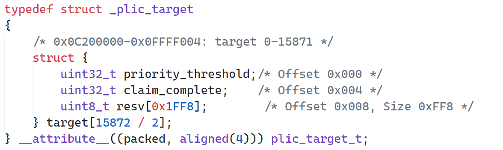
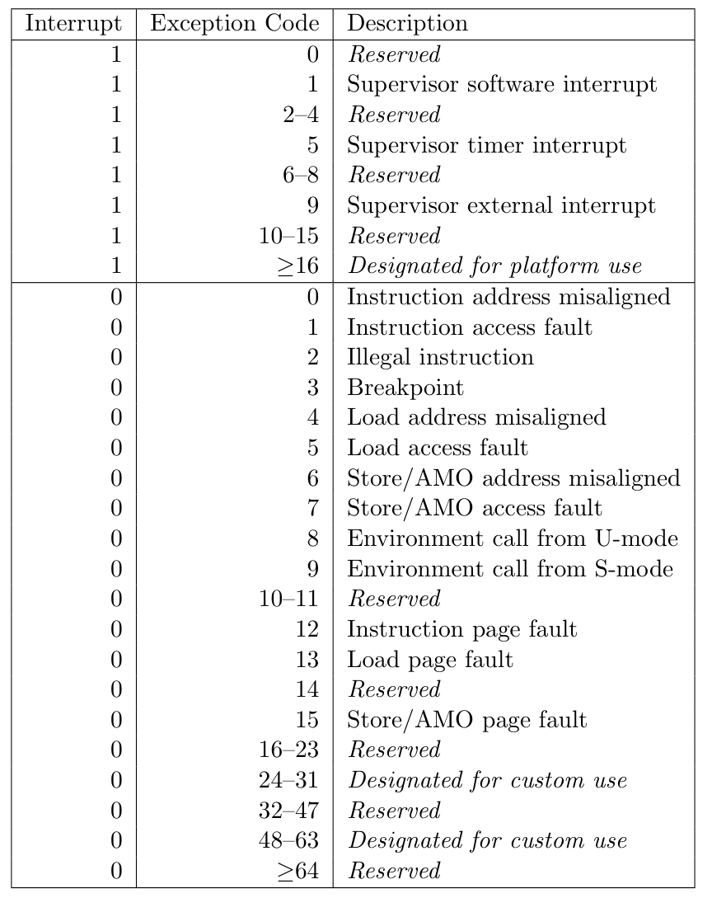

# 平台化的开发构建

tatakOS的设计目标为确定的ISA架构（riscv）与多板级平台支持（platform）。我们参考了去年其他赛队针对qemu与k210的兼容性处理方式，发现大多数采用的是构建工具（makefile）+在代码中插入宏判断的方式来维持这种兼容性，这就会使得平台相关代码与内核代码耦合度过高，在兼容新平台时，不得不去面对大量代码的兼容问题！

一些平台相关的差异点列举如下：

1. 内存大小不同
2. 外设不同
3. PLIC中断号不同
4. 通用设备（如PLIC、CLINT）基址不同
5. ...

出于这样的目的，我们努力将platform与kernel分离，通过定义与实现相关的平台初始化/处理接口，来达到解耦的目的。

我们首先的工作是移植官方standalone的PLIC驱动代码实现。移植的原因在于原先xv6的代码仅仅针对qemu下所需要的外部中断做了处理，同时在针对中断处理机制上，xv6仅仅针对uart与virt_disk写了相关的中断处理函数，并没有提供统一的中断处理函数注册机制。为了更全面地管理中断，同时也为了日后更好地添加其他平台中断（这里需要注意：各个平台的`plic_base_adress`与中断号设置等是平台相关的），更强大的PLIC管理机制是亟需的。

## 调试杂谈

在移植PLIC过程中，发生了许多充满悲喜剧的bug。

首先，官方PLIC仅仅只针对M态下context做了兼容处理，对于奇数项（S态）的context，要么直接定义为了resve，要么直接在设置的过程中略过：



很典型的，上图中的`plic_target`结构体定义中，奇数context被直接包括在了resv字段中，这也就是为什么外部的target数组数目需要除以2。

当花了大量时间按照官方规范处理完上述一些配置后，发现qemu下无法进入用户程序了！第一时间肯定是怀疑自己的PLIC驱动有误，查看中断输出大量的uart中断请求，我们刚开始由于**缺乏对中断请求时间频率的概念**（这一段可能uart确实有问题），排查一遍，问题仍然存在，观察原版代码输出，一模一样，输出也是如此，期间还重写了一遍plic代码，最终问题定位在了`usertrap`上，中间想要通用化状态寄存器管理，改了些许状态寄存器的读取，造成了问题。

以为bug到此为止，结果发现用户程序莫名其妙地触发`5`与`9`异常，这两者分别为`load access fault`与`environment call from S`！前者还好理解，为什么用户态下会发生S态下的ecall呢？？简直不可想象。这个问题调试了将近一天一夜，依旧没有任何头绪，就算是`load access fault`那起码也有`stval`被置位才对，但是`stval = 0`！

直到偶然复盘`usertrap`的相关代码，在第一行发现了如下代码：

```C
int scause = r_scause();
```

看着不对劲，`uint64 to int`？同时编译器也没有报警告？那如此，返回的`scause`不就被截断了吗？？！！再反观riscv-spec-privileged中的table：

<div aligin="center"></div>

若`5`与`9`加入头部中断标识位`1`，那么就对应的是`Supervisor timer interrupt`与`Supervisor external interrupt`！如此愚蠢的错误竟然耗费了这么长时间的调试，这也不禁引人反思。

<p align="right">by 杨宗振<br />2022/4/11</p>


